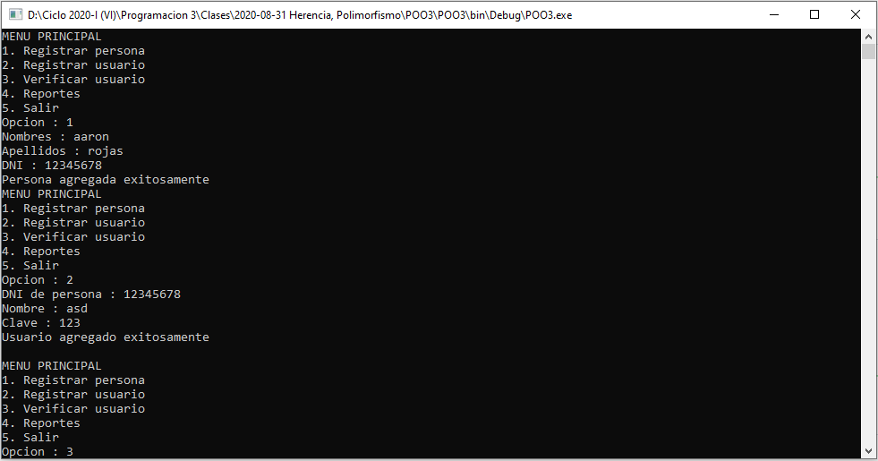
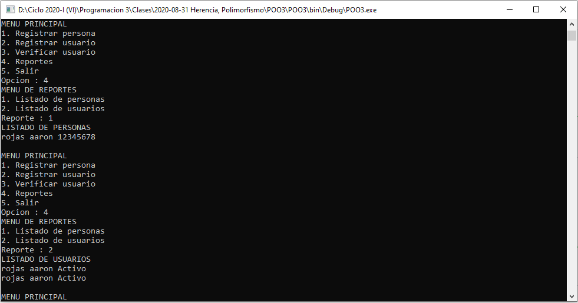

# Control de personas y usuarios
Sistema de control de personas y usuarios que permite ingresar los datos de una persona, ingresar los datos de un usuario para una persona, verificar los datos de un usuario y en los reportes tenemos mostrar las personas registradas y mostrar los usuarios registrados, **31/08/20**.

<strong>Imagen:</strong> Menú principal - Registrar personas.

<strong>Imagen:</strong> Menú de reportes - Listado de personas.

